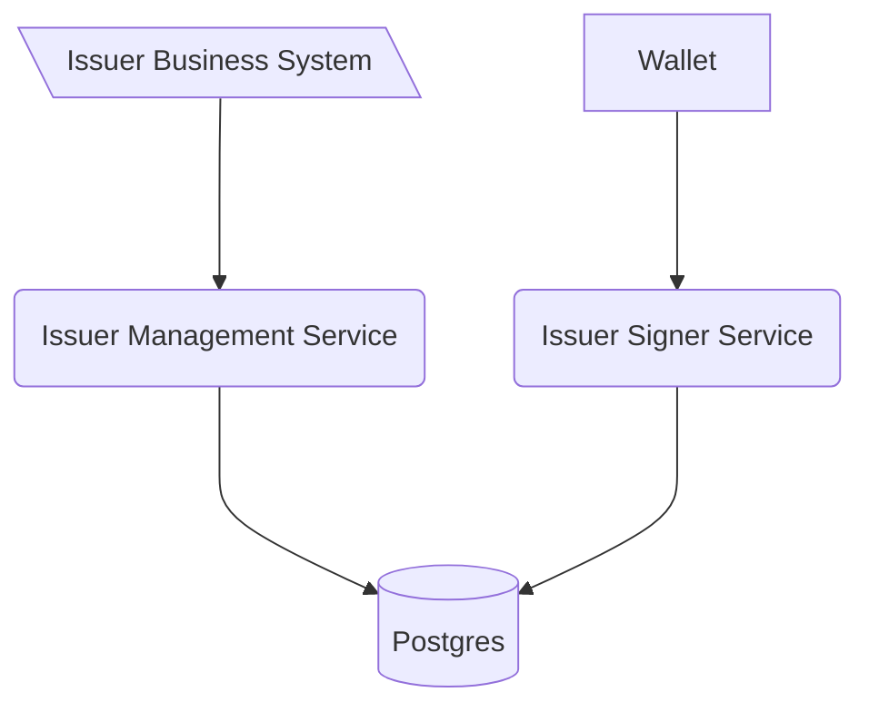

# Generic Issuer management service
This software is a web server implementing the technical standards as specified in the [Swiss E-ID & Trust Infrastructure technical roadmap](https://github.com/e-id-admin/open-source-community/blob/main/tech-roadmap/tech-roadmap.md). Together with the other generic components provided, this software forms a collection of APIs allowing issuance and verification of verifiable credentials without the need of reimplementing the standards.

The Generic Issuer Management Service is the interface to offer a credential. It should be only accessible from the issuers internal organization.

As with all the generic issuance & verification services it is expected that every issuer and verifier hosts their own instance of the service.

The issuer management service is linked to the issuer signer services through a database, allowing to scale the signer service independently from the management service.

# Development
## Setup

- Start application IssuerManagementApplication with local profile
  - Starts docker compose for database
  - Runs Flyway migrations if needed
- Api definitions can be found [here](http://localhost:8080/swagger-ui/index.html#/)

## Configuration
The Generic Issuer Agent Management is configured using environment variables.

| Variable     | Description                                                                                     |
|--------------|-------------------------------------------------------------------------------------------------|
| POSTGRES_USER | Username to connect to the Issuer Agent Database shared with the issuer agent managment service |
| POSTGRES_PASSWORD | Username to connect to the Issuer Agent Database |
| POSTGRES_JDBC | JDBC Connection string to the shared DB |
| EXTERNAL_URL | The URL of the Issuer Signer. This URL is used in the credential offer link sent to the Wallet  |
| ENABLE_JWT_AUTH | Enables the requirement of writing calls to the issuer management to be signed JWT |
| JWKS_ALLOWLIST | A Json Web Key set of the public keys authorized to do writing calls to the issuer management service | 

### JWT Based Authentication
If there is the need to further protect the API it is possible to enable the feature with a flag and
set the environment variables with the allowed public key as a JSON Web Key Set

    ENABLE_JWT_AUTH=true
    JWKS_ALLOWLIST={"keys":[{"kty":"EC","crv":"P-256","kid":"testkey","x":"_gHQsZT-CB_KvIfpvJsDxVSXkuwRJsuof-oMihcupQU","y":"71y_zEPAglUXBghaBxypTAzlNx57KNY9lv8LTbPkmZA"}]}

If the JWT based authentication is activated it's expected to all in calls be wrapped in a signed JWT with the claim "data".
The value of the data claim will contain the full json body of the normal request.  

Note that this is only affects writing calls.

## Contribution

We appreciate feedback and contribution. More information can be found in the [CONTRIBUTING-File](/CONTRIBUTING.md).

## License

This project is licensed under the terms of the MIT license. See the [LICENSE](/LICENSE) file for details.