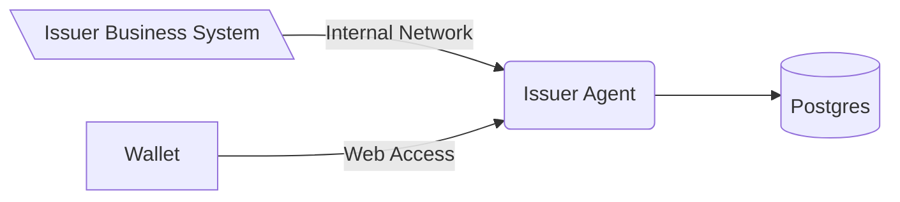
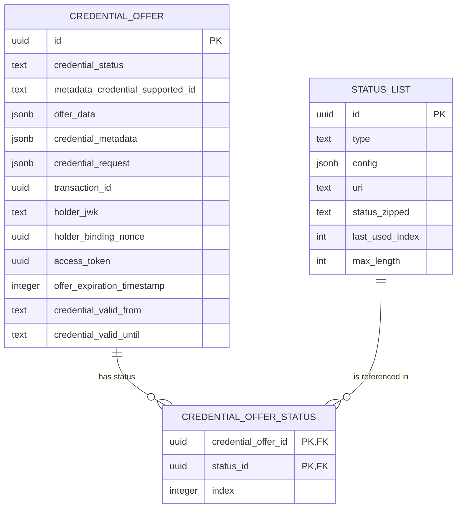
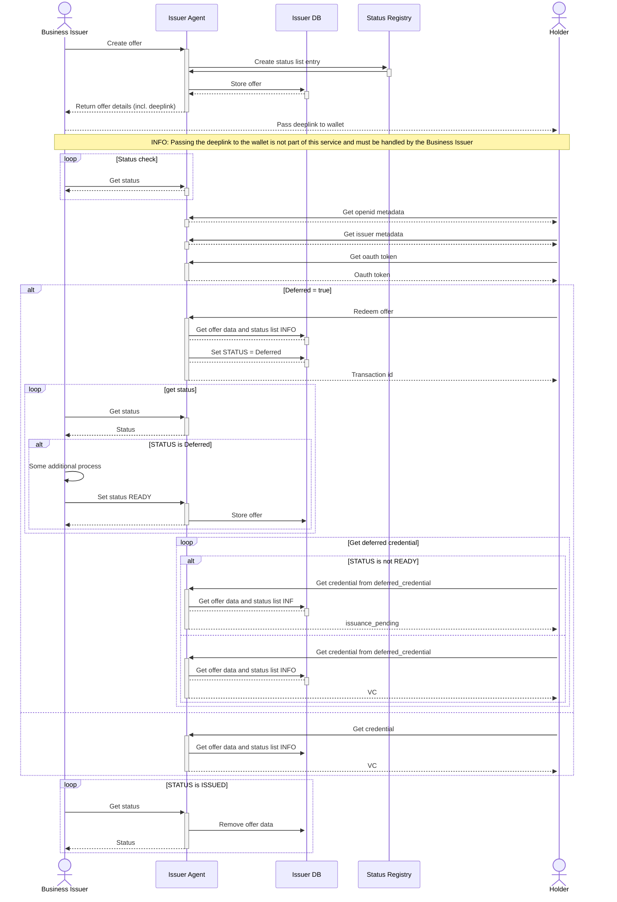
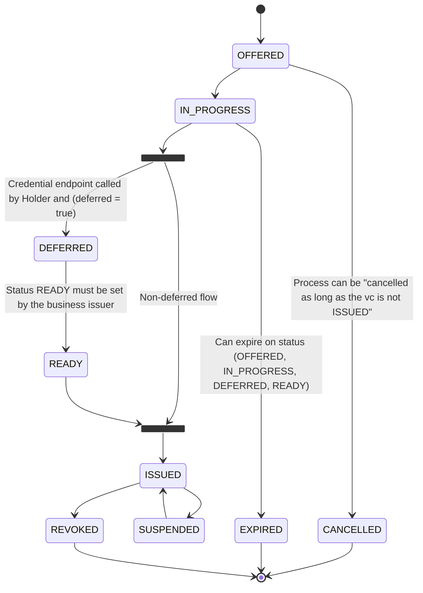

<!--
SPDX-FileCopyrightText: 2025 Swiss Confederation

SPDX-License-Identifier: MIT
-->


# Generic issuer service

This software is a web server implementing the technical standards as specified in
the [Swiss e-ID and trust infrastructure: Initial implementation](https://swiyu-admin-ch.github.io/initial-technology/).
Together with the other generic components provided, this software forms a collection of APIs allowing issuance and
verification of verifiable credentials without the need of reimplementing the standards.

The Generic Issuer Service is the interface to offer a credential. It should be only accessible from the
issuers internal organization.

As with all the generic issuance & verification services it is expected that every issuer and verifier hosts their own
instance of the service.

## Table of Contents

- [Overview](#Overview)
- [Deployment](#deployment)
- [Development](#development)
- [SWIYU](#swiyu)
- [Contributions and feedback](#contributions-and-feedback)
- [License](#license)

## Overview



# Deployment

> Please make sure that you did the following before starting the deployment:
>
> - Generated the signing keys file with the didtoolbox.jar
> - Generated a DID which is registered on the identifier registry
> - Registered yourself on the swiyuprobeta portal
> - Registered yourself on the api self service portal

> Are you a third-party user? Then you're right here! Otherwhise go to [gov internal usage](#Gov-internal-usage)

## 1. Set the environment variables

A sample compose file for an entire setup of both components and a database can be found
in [sample.compose.yml](sample.compose.yml) file.
**Replace all placeholder <VARIABLE_NAME>**.

Please be aware that both the issuer-agent needs to be publicly accessible over  a domain configured in `EXTERNAL_URL` 
so that a wallet can communicate with them.

## 2. Create a verifiable credentials schema

In order to support your use case you need to adapt the so-called issuer_metadata (
see [sample.compose.yml](sample.compose.yml#L85)).
Those metadata define the appearance of the credential in the wallet and what kind of credential formats are supported.
For further information consult the [Cookbooks](https://swiyu-admin-ch.github.io/cookbooks/)

## 3. Initialize the status list

Once the issuer-agent and postgres instance are up and running you need to initialize the status
list of your issuer so that you can issue credentials with a status. 

It is possible to issue credentials without status. Be wary though, as these credentials can not be revoked anymore!

**Request to create an status list slot**  
The url you'll receive in the response will be used in the next request as STATUS_JWT_URL

```bash
curl -X POST https://<SWIYU_STATUS_REGISTRY_API_URL>/api/v1/status/business-entities/<SWIYU_PARTNER_ID>/status-list-entries/ \
  -H "Content-Type: application/json" \
  -H "Authorization: Bearer <SWIYU_STATUS_REGISTRY_ACCESS_TOKEN>" \
  -d '{}'


```

The following request needs to be run on your issuer-agent instance.

```bash
curl -X POST https://<EXTERNAL_URL of issuer-agent>/status-list \
-H "Content-Type: application/json" \
-d '{
    "uri": "<STATUS_JWT_URL>",
    "type": "TOKEN_STATUS_LIST",
    "maxLength": 100000,
    "config": {
    "bits": 2
    }
  }'

```

## 4. Issue credential

You're now ready to issue credentials by using the issuer-agent API which is accessible under
https://<EXTERNAL_URL of issuer-agent>**/swagger-ui/index.html#/Credential%20API/createCredential** to create
a credential offer for a holder. Here is an example of a request body for the offer creation

```json
{
    "metadata_credential_supported_id": [
        "myIssuerMetadataCredentialSupportedId"
    ],
    "credential_subject_data": {
        "lastName": "Example",
        "firstName": "Edward"
    },
    "offer_validity_seconds": 86400,
    "credential_valid_until": "2030-01-01T19:23:24Z",
    "credential_valid_from": "2010-01-01T18:23:24Z",
    "status_lists": [
        "https://example-status-registry-uri/api/v1/statuslist/05d2e09f-21dc-4699-878f-89a8a2222c67.jwt"
    ]
}
```

### VCT - verifiable credential type
A verifiable credential in the sd-jwt vc format has a vct claim. The content of this is set through the issuer metadata for each credential configuration supported entry. The vct can be a string or URL. If it is a URL it should be resolveable to SD-JWT VC Type Metadata.
When providing a URL, it is recommended to use a subresource integrity [sri](https://developer.mozilla.org/de/docs/Web/Security/Subresource_Integrity) hash.
The integrity hash is provided with each created credential offer in the offer metadata while issuing the credential.
The integrity can be calculated using shell commands.

`echo "sha256-$(wget -O- http://localhost:8080/vct/my-vct-v01 | openssl dgst -binary -sha256 | openssl base64 -A)"`

```json
{
    "metadata_credential_supported_id": [
        "myIssuerMetadataCredentialSupportedId"
    ],
    "credential_subject_data": {
        "lastName": "Example",
        "firstName": "Edward"
    },
    "offer_validity_seconds": 86400,
    "credential_valid_until": "2030-01-01T19:23:24Z",
    "credential_valid_from": "2010-01-01T18:23:24Z",
    "status_lists": [
        "https://example-status-registry-uri/api/v1/statuslist/05d2e09f-21dc-4699-878f-89a8a2222c67.jwt"
    ],
    "credential_metadata": {
        "vct#integrity": "sha256-JXU3403niPeAUi8FN0IX6wfXafrgusykHC1LpKMOO94="
    }
}
```

More details on the vct claim can be found in the [swiss profile](https://github.com/e-id-admin/open-source-community/blob/main/tech-roadmap/swiss-profile.md#sd-jwt-vc) and the latest version of [SD-JWT-based Verifiable Credentials](https://datatracker.ietf.org/doc/draft-ietf-oauth-sd-jwt-vc/). For compatibility with other ecosystem participants, please use the adoptions as shown in the swiss profile.

# Development

> Please be aware that this section **focus on the development of the issuer agent service**. For the deployment of
> the
> component please consult [deployment section](#Deployment).

## Setup

- Start application IssuerApplication with local profile

  - Starts docker compose for database
  - Runs Flyway migrations if needed

### Updating Openapi Spec

The `openapi.yaml` can be updated by using the generate-doc profile.

```
mvn verify -P generate-doc
```

## Configuration

If you start the application with the local profile as described below, you need to set the credentials for the
status-list api-gateway api in the `application-local.yml` file. The credentials can be obtained from the swiyu
portal. The following properties need to be set:

1. If you have a client key and secret you have to set the following properties in the `application-local.yml` file:

```yaml
swiyu:
    status-registry:
    customer-key: "customer-key"
    customer-secret: "customer-secret"
```

2. If you have a refresh token you have to set the following properties in the `application-local.yml`

```yaml
swiyu:
    status-registry:
        api-url: "https://api-url"
        enable-refresh-token-flow: true
        bootstrap-refresh-token: "your refresh token"
```

> [!NOTE]  
> The values can also be set as environment variables. For more information check
> the [Configuration Environment Variables](#configuration-environment-variables) section.

To start the application locally you can run:

```shell
mvn spring-boot:run -Dspring-boot.run.profiles=local
```

Note: This spins up a local PostgreSQL database via docker. Once running, Openapi-Documentation can be
accessed [here](http://localhost:8080/swagger-ui/index.html#/).

### Generate Keys

Currently only EC 256 keys are used.
Generate private key with:
`openssl ecparam -genkey -name prime256v1 -noout -out ec_private.pem`
Remember to keep private keys private and safe. It should never be transmitted, etc.

On the base registry the public key is published. To generate the public key form the private key we can use
`openssl ec -in private.pem -pubout -out ec_public.pem`

### Configuration Environment Variables

The Generic Issuer Agent is configured using environment variables.

#### DB Connection
| Variable                                             | Description                                                                                                                                                                                                                                                                              |
|:-----------------------------------------------------|:-----------------------------------------------------------------------------------------------------------------------------------------------------------------------------------------------------------------------------------------------------------------------------------------|
| POSTGRES_USER                                        | Username to connect to the Issuer Agent Database shared with the issuer agent managment service                                                                                                                                                                                          |
| POSTGRES_PASSWORD                                    | Username to connect to the Issuer Agent Database                                                                                                                                                                                                                                         |
| POSTGRES_JDBC                                        | JDBC Connection string to the shared DB                                                                                                                                                                                                                                                  |


#### Verifiable Credential Issuing
| Variable                             | Description                                                                                                                                                                                                                                                                              |
|:-------------------------------------|:-----------------------------------------------------------------------------------------------------------------------------------------------------------------------------------------------------------------------------------------------------------------------------------------|
| EXTERNAL_URL                         | The URL of the Issuer Signer. This URL is used in the credential offer link sent to the Wallet                                                                                                                                                                                           |
| ISSUER_ID                            | DID of the Credential Issuer. This will be written to the credential and used during verification                                                                                                                                                                                        |
| CREDENTIAL_OFFER_EXPIRATION_INTERVAL | The interval in which expired offers are cleared from the storage in the [ISO 8601 duration format](https://en.wikipedia.org/wiki/ISO_8601#Durations). The default value is 15min. This should not be confused with the time an offer is actually valid, which is controlled per request |
| OPENID_CONFIG_FILE                   | JSON file containing the OpenID Connect Configuration of the Issuer. Placeholder replacement is done as described in Config File Placeholders                                    |
| METADATA_CONFIG_FILE                 | The OID4VCI Metadata as a json. Placeholder replacement is done as described in Config File Placeholders. For details on the OID4VCI Metadata consult the OID4VCI Specification. |
| SDJWT_KEY (Optional - See HSM)       | The private key used to sign SD-JWT Credentials. The matching public key must be published on the base registry for verification. - Not recommended.                             |
| DID_SDJWT_VERIFICATION_METHOD        | The full DID with fragment as used to find the public key for sd-jwt VCs in the DID Document. eg: `did:tdw:<base-registry-url>:<issuer_uuid>#<sd-jwt-public-key-fragment>`       |


#### Status List
| Variable                                             | Description                                                                                                                                                                                                                                                                              |
|:-----------------------------------------------------|:-----------------------------------------------------------------------------------------------------------------------------------------------------------------------------------------------------------------------------------------------------------------------------------------|
| STATUS_LIST_KEY                                      | Private Signing Key for the status list vc, the matching public key should be published on the base registry                                                                                                                                                                             |
| DID_STATUS_LIST_VERIFICATION_METHOD                  | Verification Method (id of the public key as in did doc) of the public part of the status list signing key. Contains the whole did:tdw:....#keyFragment                                                                                                                                  |
| SWIYU_PARTNER_ID                                     | Your business partner id. This is provided by the swiyu portal.                                                                                                                                                                                                                          |
| SWIYU_STATUS_REGISTRY_API_URL                        | The api url to use for requests to the status registry api. This is provided by the swiyu portal.                                                                                                                                                                                        |
| SWIYU_STATUS_REGISTRY_TOKEN_URL                      | The token url to get authentication to use the status registry api. This is provided by the swiyu portal.                                                                                                                                                                                |
| SWIYU_STATUS_REGISTRY_CUSTOMER_KEY                   | The customer key to use for requests to the status registry api. This is provided by the api self managment portal.                                                                                                                                                                      |
| SWIYU_STATUS_REGISTRY_CUSTOMER_SECRET                | The customer secret to use for requests to the status registry api. This is provided by the api self managment portal.                                                                                                                                                                   |
| SWIYU_STATUS_REGISTRY_AUTH_ENABLE_REFRESH_TOKEN_FLOW | Decide if you want to use the refresh token flow for requests to the status registry api. Default: true                                                                                                                                                                                  |
| SWIYU_STATUS_REGISTRY_BOOTSTRAP_REFRESH_TOKEN        | The customer refresh token to bootstrap the auth flow for for requests to the status registry api. This is provided by the api self managment portal.                                                                                                                                    |


#### Monitoring
| Variable                       | Description                                                                                                                                                                                                                                                                              |
|:-------------------------------|:-----------------------------------------------------------------------------------------------------------------------------------------------------------------------------------------------------------------------------------------------------------------------------------------|
| MONITORING_BASIC_AUTH_ENABLED  | Enables basic auth protection of the /actuator/prometheus endpoint. (Default: false)                                                                                                                                                                                                     |
| MONITORING_BASIC_AUTH_USERNAME | Sets the username for the basic auth protection of the /actuator/prometheus endpoint.                                                                                                                                                                                                    |
| MONITORING_BASIC_AUTH_PASSWORD | Sets the password for the basic auth protection of the /actuator/prometheus endpoint.                                                                                                                                                                                                    |


#### JWT Based Data Integrity
If there is the need to further protect the API / Data Integrity it is possible to enable the feature with a flag and
set the environment variables with the allowed public key as a JSON Web Key Set

| Variable                  | Description                                                                                                                                                                                                                     |
|:--------------------------|:--------------------------------------------------------------------------------------------------------------------------------------------------------------------------------------------------------------------------------|
| ENABLE_JWT_AUTH           | Enables the requirement of writing calls to the issuer agent to be signed JWT                                                                                                                                                       |
| JWKS_ALLOWLIST (Optional) | When ENABLE_JWT_AUTH is set to true with this property the public keys authorized to perform a writing call can be set as a Json Web Key set according to [RFC7517](https://datatracker.ietf.org/doc/html/rfc7517#appendix-A.1) |


```
    ENABLE_JWT_AUTH=true
    JWKS_ALLOWLIST={"keys":[{"kty":"EC","crv":"P-256","kid":"testkey","x":"_gHQsZT-CB_KvIfpvJsDxVSXkuwRJsuof-oMihcupQU","y":"71y_zEPAglUXBghaBxypTAzlNx57KNY9lv8LTbPkmZA"}]}
```

If the JWT based authentication is activated it's expected to all in calls be wrapped in a signed JWT with the claim "
data".
The value of the data claim will contain the full json body of the normal request.

Note that this is only affects writing calls.

#### Data Integrity Check

To provide a data integrity check with the issuer it is possible to provide the credential subject data as JWT.

See [CredentialOfferCreateJWTIT.java](src/test/java/ch/admin/bj/swiyu/issuer/management/it/CredentialOfferCreateJwtIT.java)
for examples on how to use.

#### Kubernetes Vault Keys

| Variable                                             | Description                                                                                                                                           |
|------------------------------------------------------|-------------------------------------------------------------------------------------------------------------------------------------------------------|
| secret.db.username                                   | Username to connect to the Issuer Agent Database shared with the issuer agent managment service                                                       |
| secret.db.password                                   | Username to connect to the Issuer Agent Database                                                                                                      |
| secret.key.sdjwt.key                                 | Private Key used to sign jwt_vc / SD-JWT Verifiable Credentials                                                                                       |
| secret.key.status-list.key                           | Private Signing Key for the status list vc, the matching public key should be published on the base registry                                          |
| secret.swiyu.status-registry.customer-key            | The customer key to use for requests to the status registry api. This is provided by the api self managment portal.                                   |
| secret.swiyu.status-registry.customer-secret         | The customer secret to use for requests to the status registry api. This is provided by the api self managment portal.                                |
| secret.swiyu.status-registry.bootstrap-refresh-token | The customer refresh token to bootstrap the auth flow for for requests to the status registry api. This is provided by the api self managment portal. |

#### HSM - Hardware Security Module

For operations with an HSM, the keys need not be mounted directly into the environment running this application.
Instead, a connection is created to the HSM via JCA. This can be with
the [Sun PKCS11 provider](https://docs.oracle.com/en/java/javase/22/security/pkcs11-reference-guide1.html) or a vendor
specific option.
Note that for creating the keys it is expected that the public key is provided as self-signed certificated.

| Variable                      | Description                                                                                                                                                                                |
|-------------------------------|--------------------------------------------------------------------------------------------------------------------------------------------------------------------------------------------|
| SIGNING_KEY_MANAGEMENT_METHOD | This variable serves as selector. `key` is used for a mounted key. `pkcs11` for the sun pkcs11 selector. For vendor specific libraries the project must be compiled with these configured. |
| HSM_HOST                      | URI of the HSM Host or Proxy to be connected to                                                                                                                                            |
| HSM_PORT                      |                                                                                                                                                                                            |
| HSM_USER                      | User for logging in on the host                                                                                                                                                            |
| HSM_PASSWORD                  | Password for logging in to the HSM                                                                                                                                                         |
| HSM_PROXY_USER                |                                                                                                                                                                                            |
| HSM_PROXY_PASSWORD            |                                                                                                                                                                                            |
| HSM_USER_PIN                  | For some proprietary providers required pin                                                                                                                                                |
| HSM_KEY_ID                    | Key identifier or alias, or label when using pkcs11-tool                                                                                                                                   |
| HSM_KEY_PIN                   | Optional pin to unlock the key                                                                                                                                                             |
| HSM_STATUS_KEY_ID             | Key identifier or alias, or label when using pkcs11-tool for status list key. If not set will use HSM_KEY_ID                                                                               |
| HSM_STATUS_KEY_PIN            | Optional pin to unlock the status list key. If not set will use HSM_KEY_PIN                                                                                                                |
| HSM_CONFIG_PATH               | File Path to the HSM config file when using [Sun PKCS11 provider](https://docs.oracle.com/en/java/javase/22/security/pkcs11-reference-guide1.html)                                         |

#### Config File Templating

The content of the metadata json files, among these METADATA_CONFIG_FILE and OPENID_CONFIG_FILE can be annotated with
template values.
By default, the external-url can be always used.

```
{
  "issuer": "${external-url}",
  "token_endpoint": "${external-url}/token"
}
```

Using Spring environment variables arbitrary environment variables can be used for the templating.

Let's say we want to add a prefix to the display name for your VC depending on the environment your issuer runs on.
This can be achieved by adding in a template value, which is in essence an arbitrary string decorated by ${}.
In this case we choose "stage". The environment variables are all in caps.
See
the [official Spring documentation](https://docs.spring.io/spring-boot/docs/2.6.1/reference/html/features.html#features.external-config.typesafe-configuration-properties.relaxed-binding.environment-variables)
for further information.

```
...
      "display": [
        {
          "name": "${stage}MyCredential",
...
```

In our deployment we can set the value by adding in the environment variable
`APPLICATION_TEMPLATEREPLACEMENT_STAGE=dev-`


#### Allowed Issuer Metadata config values

> The paths specified below are referring to the json structure of the credential issuer metadata as specified in
> the [OpenID4VCI sepcificiation](https://openid.net/specs/openid-4-verifiable-credential-issuance-1_0-ID1.html#section-11.2.3)

| Config path                                                                   | Allowed values                                                   | Required | Comment                                                   |
|-------------------------------------------------------------------------------|------------------------------------------------------------------|----------|-----------------------------------------------------------|
| credential_response_encryption.alg_values_supported                           | ["RSA-OAEP-256","ECDH-ES+A128KW"]                                | Yes      |                                                           |
| credential_response_encryption.enc_values_supported                           | ["A128CBC-HS256"]                                                | Yes      |                                                           |
| version                                                                       | "1.0"                                                            | Yes      |                                                           |
| credential_configurations_supported.*.format                                  | "vc+sd-jwt"                                                      | Yes      |                                                           |
| credential_configurations_supported.*.credential_signing_alg_values_supported | ["ES256"]                                                        | Yes      |                                                           |
| credential_configurations_supported.*.proof_types_supported                   | ``` "jwt": {"proof_signing_alg_values_supported": ["ES256"]} ``` | No       | When set only the exact object shown as sample is allowed |
| credential_configurations_supported.*.cryptographic_binding_methods_supported | ["did:jwk"]                                                      | No       |                                                           |

#### VC Metadata provisioning

In some simpler deployments no content delivery network is available to provide credential metadata for things like
vct (verifiable credential type), json schemas or overlays capture architecture. In this case the desired files can be
mounted in similar fashion to the issuer metadata.
A significant difference is though that the file locations are specified ad-hoc with spring environment variables as
documented in [Config File Templating](#config-file-templating)

Placeholders in these files will be replaced as well.

| Variable Map                                          | Destination                |
|-------------------------------------------------------|----------------------------|
| APPLICATION_VCTMETADATAFILES_                         | $EXTERNAL_URL/vct/         |
| APPLICATION_JSONSCHEMAMETADATAFILES_                  | $EXTERNAL_URL/json-schema/ |
| APPLICATION_OVERLAYSCAPTUREARCHITECTUREMETADATAFILES_ | $EXTERNAL_URL/oca/         |

For example we could use the file `/cfg-files/vct-test.json` by setting
`APPLICATION_VCTMETADATAFILES_TESTV1=file:/cfg-files/vct-test.json`.
The content of vct-test.json will then be available at `$EXTERNAL_URL/vct/testv1`


## Data Structure



Note: Status List info comes from config and are populated to the DB the first time a Credential uses the status.
ID of the credential offer is also the id used by the issuer adapter (the component communicating with the issuer agent)
to revoke the credential. It is returned when a new offer is created. It's recommended to save this id to
revoke the credential later on.

## Credential flows



## Credential Status



## SWIYU

### Status registry

To use the swiyu status registry to host your status lists you need a registration via ePortal to the swiyu ecosystem.
To get the appropriate credentials please visit the swiyu portal application on ePortal.

For access to the swiyu api you need a refresh token along with your other credentials, please see the `SWIYU_*`
environment variables for further details.

The refresh token can only be used one time, but dont worry: the application does manage the refresh tokens itself.  
But if your issuer agent component does not run for over a week it might be possible that the refresh token
saved in the database is no longer valid and cannot be used to start the api auth flow.  
If this is the case you need to manually create a new refresh token in the api self service portal and bootstrap your
issuer agent managment component with this token.  
The application does log an appropriate error if it detects such an issue but will still start up.  
Updates to the status registry will fail as long as the auth flow is not restarted with a valid bootstrap token.

#### Setup a local environment

1. Navigate to ePortal
2. Search and select the application **swiyu pro beta**
3. Create a new business partner (scroll to bottom of AGBs)
4. Navigate again to ePortal
5. Search and select the application **API Selfservice Portal**
6. Select the API **swiyucorebusiness_status**
7. Click the blue botton "Abonnieren Sie"
8. Create a new application for this instance
9. Use Customer Key & Secret to configure application-local.yml
10. Onboard via API Gateway (TODO)

## Contributions and feedback

The code for this repository is developed privately and will be released after each sprint. The published code can
therefore only be a snapshot of the current development and not a thoroughly tested version. However, we welcome any
feedback on the code regarding both the implementation and security aspects. Please follow the guidelines for
contributing found in [CONTRIBUTING.md](/CONTRIBUTING.md).

## License

This project is licensed under the terms of the MIT license. See the [LICENSE](/LICENSE) file for details.