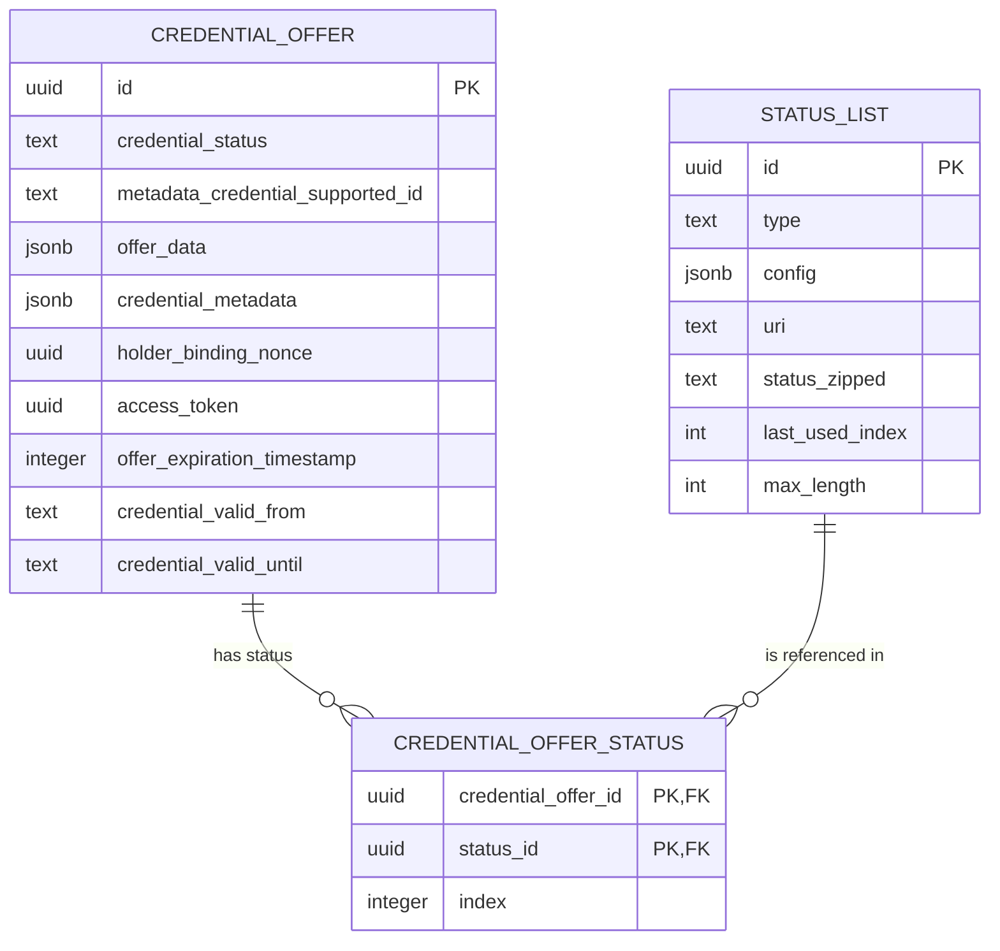

<!--
SPDX-FileCopyrightText: 2025 Swiss Confederation

SPDX-License-Identifier: MIT
-->


# Generic issuer management service

This software is a web server implementing the technical standards as specified in
the [Swiss e-ID and trust infrastructure: Initial implementation](https://swiyu-admin-ch.github.io/initial-technology/).
Together with the other generic components provided, this software forms a collection of APIs allowing issuance and
verification of verifiable credentials without the need of reimplementing the standards.

The Generic Issuer Management Service is the interface to offer a credential. It should be only accessible from the
issuers internal organization.

As with all the generic issuance & verification services it is expected that every issuer and verifier hosts their own
instance of the service.

The issuer management service is linked to the issuer signer services through a database, allowing to scale the signer
service independently from the management service.

## Table of Contents

- [Overview](#Overview)
- [Deployment](#deployment)
- [Development](#development)
- [SWIYU](#swiyu)
- [Contributions and feedback](#contributions-and-feedback)
- [License](#license)

## Overview


# Deployment

> Please make sure that you did the following before starting the deployment:
>
> - Generated the signing keys file with the didtoolbox.jar
> - Generated a DID which is registered on the identifier registry
> - Registered yourself on the swiyuprobeta portal
> - Registered yourself on the api self service portal

> Are you a third-party user? Then you're right here! Otherwhise go to [gov internal usage](#Gov-internal-usage)

## 1. Set the environment variables

A sample compose file for an entire setup of both components and a database can be found
in [sample.compose.yml](sample.compose.yml) file.
**Replace all placeholder <VARIABLE_NAME>**.

Please be aware that both the issuer-agent-management and the issuer-agent-oid4vci need to be publicly accessible over
an domain configured in `EXTERNAL_URL` so that
a wallet can communicate with them.

## 2. Create a verifiable credentials schema

In order to support your use case you need to adapt the so-called issuer_metadata (
see [sample.compose.yml](sample.compose.yml#L85)).
Those metadata define the appearance of the credential in the wallet and what kind of credential formats are supported.
For further information consult the [Cookbooks](https://swiyu-admin-ch.github.io/cookbooks/)

## 3. Initialize the status list

Once the issuer-agent-management, issuer-agent-oid4vci and postgres instance are up and running you need to initialize
the status
list of your issuer so that you can issue credentials.

**Request to create an status list slot**  
The url you'll receive in the response will be used in the next request as STATUS_JWT_URL

```bash
curl -X POST https://<SWIYU_STATUS_REGISTRY_API_URL>/api/v1/status/business-entities/<SWIYU_PARTNER_ID>/status-list-entries/ \
  -H "Content-Type: application/json" \
  -H "Authorization: Bearer <SWIYU_STATUS_REGISTRY_ACCESS_TOKEN>" \
  -d '{}'


```

The following request needs to be run on your issuer-agent-management instance.

```bash
curl -X POST https://<EXTERNAL_URL of issuer-agent-management>/status-list \
-H "Content-Type: application/json" \
-d '{
    "uri": "<STATUS_JWT_URL>",
    "type": "TOKEN_STATUS_LIST",
    "maxLength": 800000,
    "config": {
    "bits": 2
    }
  }'

```

## 4. Issue credential

You're now ready to issue credentials by using the issuer-agent-management API which is accessible under
https://<EXTERNAL_URL of issuer-agent-management>**/swagger-ui/index.html#/Credential%20API/createCredential** to create
a credential offer for a holder. Here is an example of a request body for the offer creation

```json
{
  "metadata_credential_supported_id": [
    # Identifier as configured in the credential_configurations_supported section of the issuer_metadata "myIssuerMetadataCredentialSupportedId"
],
  "credential_subject_data": {
    # Actual content of the credential aka offer data
  "lastName": "Example",
  "firstName": "Edward"
},
"offer_validity_seconds": 86400,
"credential_valid_until": "2010-01-01T19:23:24Z",
"credential_valid_from": "2010-01-01T18:23:24Z",
"status_lists": [
# Url of the status list created in previous step
"https://example-status-registry-uri/api/v1/statuslist/05d2e09f-21dc-4699-878f-89a8a2222c67.jwt"
]
}
```

# Development

> Please be aware that this section **focus on the development of the issuer management service**. For the deployment of
> the
> component please consult [deployment section](#Deployment).

## Setup

- Start application IssuerManagementApplication with local profile

    - Starts docker compose for database
    - Runs Flyway migrations if needed

## Configuration

If you start the application with the local profile as described below, you need to set the credentials for the
status-list api-gateway api in the `application-local.yml` file. The credentials can be obtained from the swiyu
portal. The following properties need to be set:

1. If you have a client key and secret you have to set the following properties in the `application-local.yml` file:

```yaml
swiyu:
  status-registry:
  customer-key: "customer-key"
  customer-secret: "customer-secret"
```

2. If you have a refresh token you have to set the following properties in the `application-local.yml`

```yaml
swiyu:
  status-registry:
    api-url: "https://api-url"
    enable-refresh-token-flow: true
    bootstrap-refresh-token: "your refresh token"
```

> [!NOTE]  
> The values can also be set as environment variables. For more information check
> the [Configuration Environment Variables](#configuration-environment-variables) section.

To start the application locally you can run:

```shell
mvn spring-boot:run -Dspring-boot.run.profiles=local
```

Note: This spins up a local PostgreSQL database via docker. Once running, Openapi-Documentation can be
accessed [here](http://localhost:8080/swagger-ui/index.html#/).

### Generate Keys

Currently only EC 256 keys are used.
Generate private key with:
`openssl ecparam -genkey -name prime256v1 -noout -out ec_private.pem`
Remember to keep private keys private and safe. It should never be transmitted, etc.

On the base registry the public key is published. To generate the public key form the private key we can use
`openssl ec -in private.pem -pubout -out ec_public.pem`

### Configuration Environment Variables

The Generic Issuer Agent Management is configured using environment variables.

| Variable                                             | Description                                                                                                                                                                                                                                                                              |
| :--------------------------------------------------- | :--------------------------------------------------------------------------------------------------------------------------------------------------------------------------------------------------------------------------------------------------------------------------------------- |
| POSTGRES_USER                                        | Username to connect to the Issuer Agent Database shared with the issuer agent managment service                                                                                                                                                                                          |
| POSTGRES_PASSWORD                                    | Username to connect to the Issuer Agent Database                                                                                                                                                                                                                                         |
| POSTGRES_JDBC                                        | JDBC Connection string to the shared DB                                                                                                                                                                                                                                                  |
| EXTERNAL_URL                                         | The URL of the Issuer Signer. This URL is used in the credential offer link sent to the Wallet                                                                                                                                                                                           |
| ISSUER_ID                                            | DID of the Credential Issuer. This will be written to the credential and used during verification                                                                                                                                                                                        |
| ENABLE_JWT_AUTH                                      | Enables the requirement of writing calls to the issuer management to be signed JWT                                                                                                                                                                                                       |
| JWKS_ALLOWLIST                                       | When ENABLE_JWT_AUTH is set to true with this property the public keys authorized to perform a writing call can be set as a Json Web Key set according to [RFC7517](https://datatracker.ietf.org/doc/html/rfc7517#appendix-A.1)                                                          |
| STATUS_LIST_KEY                                      | Private Signing Key for the status list vc, the matching public key should be published on the base registry                                                                                                                                                                             |
| DID_STATUS_LIST_VERIFICATION_METHOD                  | Verification Method (id of the public key as in did doc) of the public part of the status list signing key. Contains the whole did:tdw:....#keyFragment                                                                                                                                  |
| SWIYU_PARTNER_ID                                     | Your business partner id. This is provided by the swiyu portal.                                                                                                                                                                                                                          |
| SWIYU_STATUS_REGISTRY_API_URL                        | The api url to use for requests to the status registry api. This is provided by the swiyu portal.                                                                                                                                                                                        |
| SWIYU_STATUS_REGISTRY_TOKEN_URL                      | The token url to get authentication to use the status registry api. This is provided by the swiyu portal.                                                                                                                                                                                |
| SWIYU_STATUS_REGISTRY_CUSTOMER_KEY                   | The customer key to use for requests to the status registry api. This is provided by the api self managment portal.                                                                                                                                                                      |
| SWIYU_STATUS_REGISTRY_CUSTOMER_SECRET                | The customer secret to use for requests to the status registry api. This is provided by the api self managment portal.                                                                                                                                                                   |
| SWIYU_STATUS_REGISTRY_AUTH_ENABLE_REFRESH_TOKEN_FLOW | Decide if you want to use the refresh token flow for requests to the status registry api. Default: true                                                                                                                                                                                  |
| SWIYU_STATUS_REGISTRY_BOOTSTRAP_REFRESH_TOKEN        | The customer refresh token to bootstrap the auth flow for for requests to the status registry api. This is provided by the api self managment portal.                                                                                                                                    |
| CREDENTIAL_OFFER_EXPIRATION_INTERVAL                 | The interval in which expired offers are cleared from the storage in the [ISO 8601 duration format](https://en.wikipedia.org/wiki/ISO_8601#Durations). The default value is 15min. This should not be confused with the time an offer is actually valid, which is controlled per request |
| MONITORING_BASIC_AUTH_ENABLED                        | Enables basic auth protection of the /actuator/prometheus endpoint. (Default: false)                                                                                                                                                                                                     |
| MONITORING_BASIC_AUTH_USERNAME                       | Sets the username for the basic auth protection of the /actuator/prometheus endpoint.                                                                                                                                                                                                    |
| MONITORING_BASIC_AUTH_PASSWORD                       | Sets the password for the basic auth protection of the /actuator/prometheus endpoint.                                                                                                                                                                                                    |
### Kubernetes Vault Keys

| Variable                                             | Description                                                                                                                                           |
| ---------------------------------------------------- | ----------------------------------------------------------------------------------------------------------------------------------------------------- |
| secret.db.username                                   | Username to connect to the Issuer Agent Database shared with the issuer agent managment service                                                       |
| secret.db.password                                   | Username to connect to the Issuer Agent Database                                                                                                      |
| secret.key.status-list.key                           | Private Signing Key for the status list vc, the matching public key should be published on the base registry                                          |
| secret.swiyu.status-registry.customer-key            | The customer key to use for requests to the status registry api. This is provided by the api self managment portal.                                   |
| secret.swiyu.status-registry.customer-secret         | The customer secret to use for requests to the status registry api. This is provided by the api self managment portal.                                |
| secret.swiyu.status-registry.bootstrap-refresh-token | The customer refresh token to bootstrap the auth flow for for requests to the status registry api. This is provided by the api self managment portal. |

### HSM - Hardware Security Module

For operations with an HSM, the keys need not be mounted directly into the environment running this application.
Instead, a connection is created to the HSM via JCA. This can be with
the [Sun PKCS11 provider](https://docs.oracle.com/en/java/javase/22/security/pkcs11-reference-guide1.html) or a vendor
specific option.
Note that for creating the keys it is expected that the public key is provided as self-signed certificated.

| Variable                      | Description                                                                                                                                                                                |
| ----------------------------- | ------------------------------------------------------------------------------------------------------------------------------------------------------------------------------------------ |
| SIGNING_KEY_MANAGEMENT_METHOD | This variable serves as selector. `key` is used for a mounted key. `pkcs11` for the sun pkcs11 selector. For vendor specific libraries the project must be compiled with these configured. |
| HSM_HOST                      | URI of the HSM Host or Proxy to be connected to                                                                                                                                            |
| HSM_PORT                      |                                                                                                                                                                                            |
| HSM_USER                      | User for logging in on the host                                                                                                                                                            |
| HSM_PASSWORD                  | Password for logging in to the HSM                                                                                                                                                         |
| HSM_PROXY_USER                |                                                                                                                                                                                            |
| HSM_PROXY_PASSWORD            |                                                                                                                                                                                            |
| HSM_USER_PIN                  | For some proprietary providers required pin                                                                                                                                                |
| HSM_KEY_ID                    | Key identifier or alias, or label when using pkcs11-tool                                                                                                                                   |
| HSM_KEY_PIN                   | Optional pin to unlock the key                                                                                                                                                             |
| HSM_CONFIG_PATH               | File Path to the HSM config file when using [Sun PKCS11 provider](https://docs.oracle.com/en/java/javase/22/security/pkcs11-reference-guide1.html)                                         |
| HSM_USER_PIN                  | PIN for getting keys from the HSM                                                                                                                                                          |

## Data Structure



Note: Status List info comes from config and are populated to the DB the first time a Credential uses the status.
ID of the credential offer is also the id used by the issuer adapter (the component communicating with the issuer agent
management) to revoke the credential. It is returned when a new offer is created. It's recommended to save this id to
revoke the credential later on.

### JWT Based Authentication

If there is the need to further protect the API it is possible to enable the feature with a flag and
set the environment variables with the allowed public key as a JSON Web Key Set

    ENABLE_JWT_AUTH=true
    JWKS_ALLOWLIST={"keys":[{"kty":"EC","crv":"P-256","kid":"testkey","x":"_gHQsZT-CB_KvIfpvJsDxVSXkuwRJsuof-oMihcupQU","y":"71y_zEPAglUXBghaBxypTAzlNx57KNY9lv8LTbPkmZA"}]}

If the JWT based authentication is activated it's expected to all in calls be wrapped in a signed JWT with the claim "
data".
The value of the data claim will contain the full json body of the normal request.

Note that this is only affects writing calls.

### Data Integrity Check

To provide a data integrity check with the issuer it is possible to provide the credential subject data as JWT.

See [CredentialOfferCreateJWTIT.java](src/test/java/ch/admin/bj/swiyu/issuer/management/it/CredentialOfferCreateJwtIT.java)
for examples on how to use.

## Credential Status


## SWIYU

### Status registry

To use the swiyu status registry to host your status lists you need a registration via ePortal to the swiyu ecosystem.
To get the appropriate credentials please visit the swiyu portal application on ePortal.

For access to the swiyu api you need a refresh token along with your other credentials, please see the `SWIYU_*`
environment variables for further details.

The refresh token can only be used one time, but dont worry: the application does manage the refresh tokens itself.  
But if your issuer agent management component does not run for over a week it might be possible that the refresh token
saved in the database is no longer valid and cannot be used to start the api auth flow.  
If this is the case you need to manually create a new refresh token in the api self service portal and bootstrap your
issuer agent managment component with this token.  
The application does log an appropriate error if it detects such an issue but will still start up.  
Updates to the status registry will fail as long as the auth flow is not restarted with a valid bootstrap token.

#### Setup a local environment

1. Navigate to ePortal
2. Search and select the application **swiyu pro beta**
3. Create a new business partner (scroll to bottom of AGBs)
4. Navigate again to ePortal
5. Search and select the application **API Selfservice Portal**
6. Select the API **swiyucorebusiness_status**
7. Click the blue botton "Abonnieren Sie"
8. Create a new application for this instance
9. Use Customer Key & Secret to configure application-local.yml
10. Onboard via API Gateway (TODO)

## Contributions and feedback

The code for this repository is developed privately and will be released after each sprint. The published code can
therefore only be a snapshot of the current development and not a thoroughly tested version. However, we welcome any
feedback on the code regarding both the implementation and security aspects. Please follow the guidelines for
contributing found in [CONTRIBUTING.md](/CONTRIBUTING.md).

## License

This project is licensed under the terms of the MIT license. See the [LICENSE](/LICENSE) file for details.
